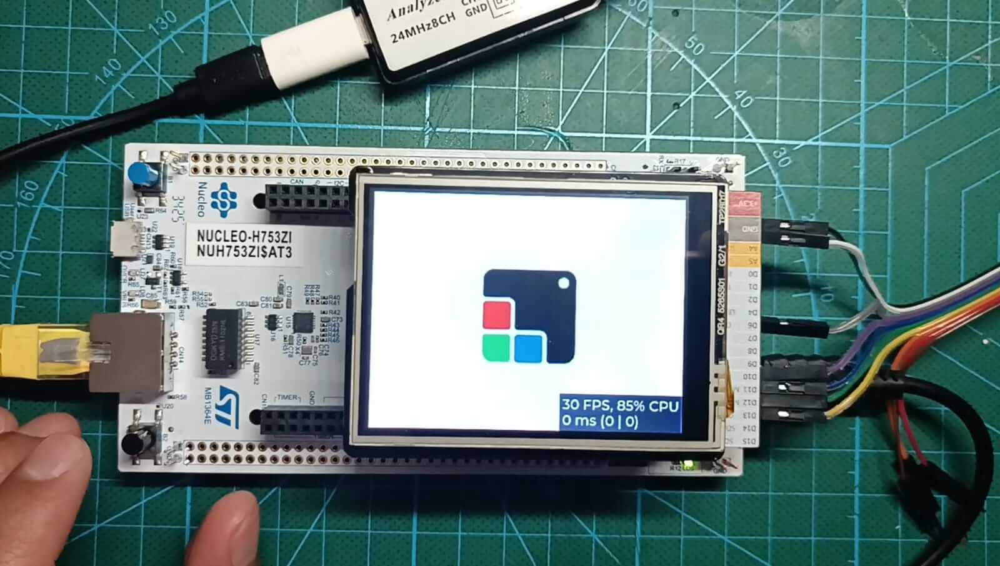

# STM32 Nucleo 144 H753ZI with ILI9341 LCD Shield and LVGL v9

## Overview
This project demonstrates running LVGL v9 on an STM32 Nucleo 144 H753ZI microcontroller with a Seeedstudio LCD Shield V2 (ILI9341 SPI display).<br>


## Prerequisites
- STM32CubeIDE installed
- Git installed
- STM32 Nucleo 144 H753ZI board
- Seeedstudio LCD Shield V2 (ILI9341)

## Setup Instructions

### 1. Clone LVGL v9
```bash
git clone https://github.com/lvgl/lvgl.git
cd lvgl
git checkout master
```

### 2. Add LVGL to Project
Copy the cloned LVGL repository to the project's `Middlewares/` folder:

```bash
cp -r lvgl <project_root>/Middlewares/lvgl
```

### 3. Open and Build in STM32CubeIDE

1. Launch **STM32CubeIDE**
2. Select **File → Open Projects from File System**
3. Navigate to the project root directory and click **Finish**
4. Right-click the project in Project Explorer and select **Build Project**
5. Connect your board via USB
6. Right-click the project and select **Run As → STM32 C/C++ Application**

## Hardware Configuration
- **Display**: ILI9341 SPI LCD (Seeedstudio Shield V2)
- **Interface**: SPI communication
- **Microcontroller**: STM32H753ZI
