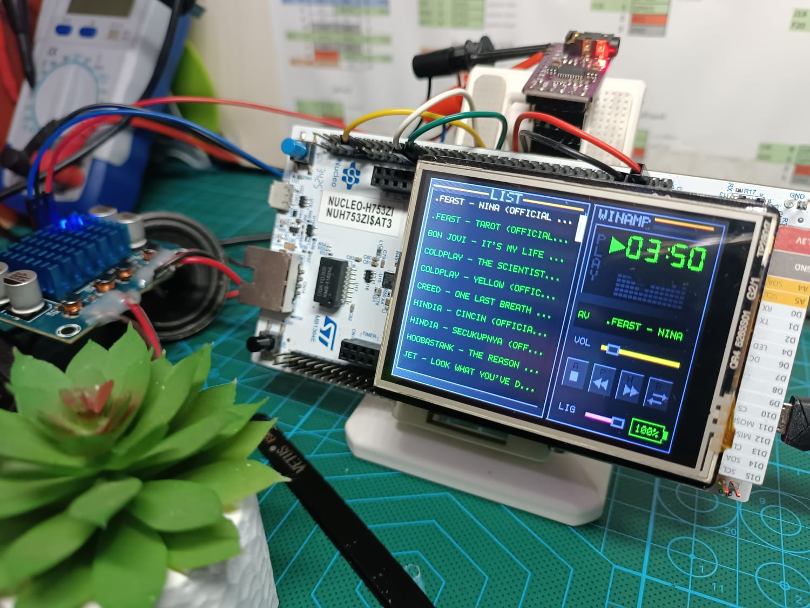

# STM32H7 Winamp-Inspired Music Player

High-performance audio player and visualizer for **NUCLEO-H753ZI** using **PCM5102A I2S DAC**, **ILI9341 LCD**, and **microSD**. Features a custom GUI inspired by the classic **Winamp** interface.

## 1) Features
- **Winamp-Inspired GUI**: Classic player layout with real-time spectrum visualization and track info.
- **16kHz / 16-bit Stereo WAV Streaming**: High-quality audio playback from microSD card.
- **Dynamic Playlist**: Automatically scans for WAV files and manages playback sequence.
- **Touch Interface**: 4-wire resistive touch support for player controls (Play/Pause, Skip, Volume, Seek).
- **Optimization**: Leverages H7's high-speed core with SAI DMA circular buffering and 15MHz SPI for glitch-free audio and smooth UI updates.
- **Audio Protection**: Soft-clipping and saturation logic to prevent digital distortion.

## 2) Hardware Setup

### Pin Mapping (NUCLEO-H753ZI)

| Peripheral | Signal | NUCLEO Pin | MCU Pin | Function |
|---|---|---|---|---|
| **I2S DAC (SAI1)** | BCK | **CN9-20** | **PE5** | SAI1_SCK_A |
| (PCM5102A) | DIN | **CN9-18** | **PE6** | SAI1_SD_A |
| | LRCK | **CN9-22** | **PE4** | SAI1_FS_A |
| | VCC / GND | 3V3 / GND | - | Power |
| **microSD (SPI1)** | SCK | **CN7-11** | **PA5** | SPI1_SCK |
| (Shared SPI1) | MISO | **CN7-13** | **PA6** | SPI1_MISO |
| | MOSI | **CN10-26** | **PB5** | SPI1_MOSI |
| | CS | **CN9-30** | **PE14** | GPIO Output (Active Low) |
| **LCD TFT (SPI1)** | SCK | (Shared) | **PA5** | SPI1_SCK |
| (ILI9341) | MOSI | (Shared) | **PB5** | SPI1_MOSI |
| | CS | **CN10-14** | **PD14** | GPIO Output (Active Low) |
| | DC / RS | **CN9-28** | **PE9** | GPIO Output (Command/Data) |
| | BACKLIGHT | **CN10-23** | **PG12** | TIM PWM / GPIO Output |
| **4-Wire Touch** | Y- | **CN7-33** | **PA3** | ADC1_INP15 |
| (Resistive) | X- | **CN7-30** | **PC0** | ADC1_INP10 |
| | Y+ | **CN7-37** | **PC3** | ADC1_INP13 |
| | X+ | **CN7-21** | **PB1** | ADC1_INP5 |

## 3) Software Details
- **Kernel Clock**: SAI1 clocked via PLL2 for precise 16kHz audio timing.
- **Display Driver**: Custom ILI9341 SPI driver with optimized block transfers.
- **Graphics Engine**: `SimpleGFX` library for fast rendering of Winamp-style UI elements.
- **File System**: FatFs (v0.15) integrated over SPI1 for robust SD card access.
- **DMA Audio**: Circular SAI DMA buffer (`AUDIO_FRAMES=512`) ensures zero-latency streaming.

## 4) Usage
1. Format microSD card as **FAT32**.
2. Load 16kHz, 16-bit PCM WAV files into the root directory.
3. Flash the firmware using **STM32CubeIDE**.
4. Use the touch screen to navigate the Winamp-style interface.
5. Debug output and system logs available via **UART (COM1, 115200 8N1)** and **SEGGER RTT**.

---
*Created as a high-fidelity demonstration of STM32H7 multimedia capabilities.*
